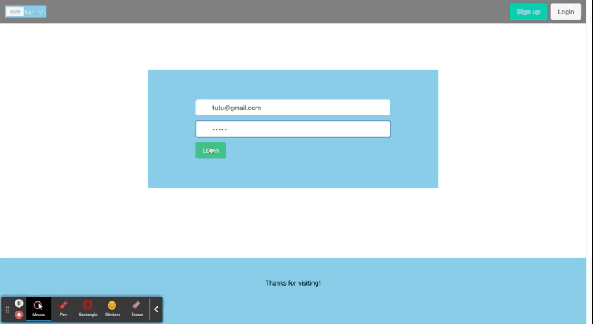

# nerdBoard

## Table of Contents
- [Heroku Link](#Heroku)
- [Contributors](#contributors)
- [Images](#images)
- [Technology](#technology)

## Description
- nerdBoard is a sinplified project management application used to track tasks and keep you organized.
- The creation of tasks and assignment of deadlines will facilitate users time managment skills.

## Heroku 
[Click Here](https://pure-tundra-46686.herokuapp.com/)
## Images

## Contributors

### Front End
* Norma De Jesus: HTML, CSS, Bulma, JS
* Chunyu Chang: HTML, CSS, Bulma, JS, Handlebars

### Back End
* Karla Romero: Handlebars, JS, SQL, Postman
* Dana Bottoni: JS, Models & Routes, HTML, CSS, Wireframe

## Technology

* Bulma
* HTML & CSS
* Express
* Node.js
* Handlebars
* Heroku
* Sequelize
* MySQL

## Questions
### Contact us through GitHub
 * [Karla](https://github.com/kmre)
 * [Chunyu](https://github.com/mr91217)
 * [Nomrma](https://github.com/ndj13)
 * [Dana](https://github.com/dbottoni)

